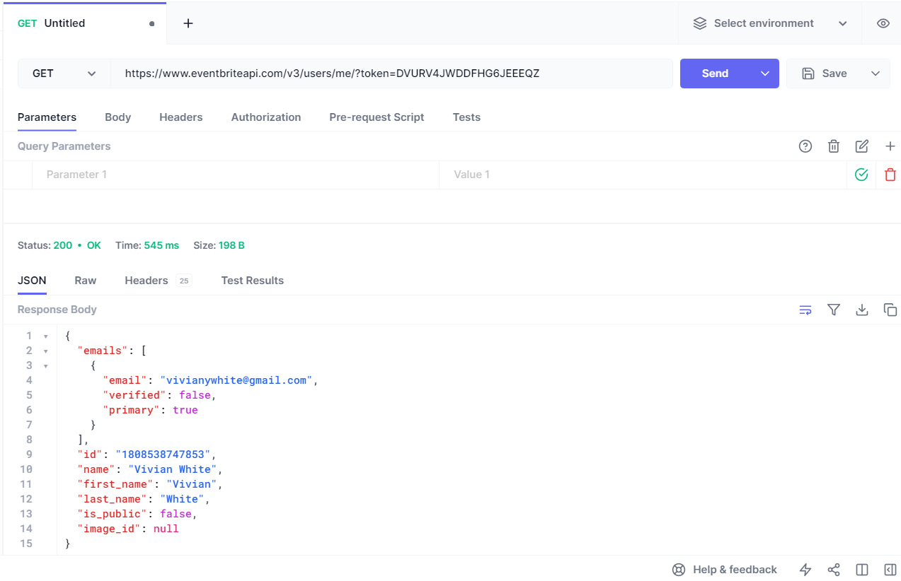
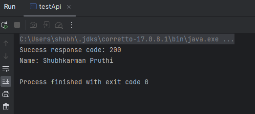

# University Event Management Project

## Problem Domain
Our team is focusing on the problem domain of university event management. Universities often have numerous events happening on campus, ranging from workshops to sports events and club meetings. Keeping track of these events, signing up for them, and receiving relevant notifications can be challenging for students and faculty. Our project aims to simplify this process by creating a centralized platform for university event management.

## Application Description
Our team is planning to develop an application that serves as an event management system for the university community. The application will allow users to:

- Browse and search for events happening within the university.
- View detailed information about each event, including date, time, location, description, and organizer.
- Sign up and register for events they are interested in attending.
- Receive notifications and reminders about upcoming events they have registered for.
- Filter events based on their academic program or interests.
- View a personalized event feed based on their enrollment and preferences.
- Allow event organizers to create and manage events.

To implement these features efficiently, we plan to integrate the Eventbrite API into our application. Eventbrite is a popular platform for event management and ticketing, offering a robust API that provides access to event data, registration details, and notification capabilities.

## Eventbrite API Documentation
You can find the documentation for the Eventbrite API [here](https://www.eventbrite.com/platform/api).

By using the Eventbrite API, we can access a wide range of features and data that will enhance our university event management platform. This includes the ability to retrieve event details, create events, manage registrations, and send notifications to users based on their preferences.
	
This initial plan serves as a starting point for our project, and we welcome feedback and suggestions for improvement.

## API Call Example

## Java Call Example

